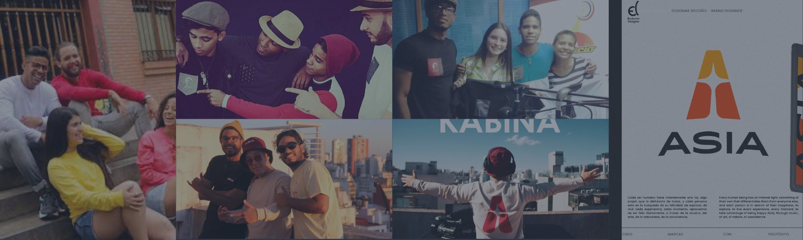

En mi viaje profesional, he tenido la oportunidad de canalizar mis intereses por el diseño, gestión y creatividad a través de diversos proyectos propios. Estos emprendimientos no solo han sido un espacio para el crecimiento personal y profesional, sino también una plataforma para colaborar con equipos de diversos índoles y enfrentar con determinación los retos del mundo empresarial. 

### **ASIA | Música Electrónica**      
#### **Co-Fundador & Co-Productor**
######  **Buenos Aires | Nov. 2023 - Presente**

ASIA es un proyecto que actualmente desarrollo junto a mi hermano [**Gabriel Briceño**](https://www.linkedin.com/in/gabriel-alejandro-brice%C3%B1o-colina-8a5458201/). Fundado en la ciudad de Buenos Aires a finales del año 2023. Abraza la visión de convertirse en un destacado referente en la organización y producción de contenido audiovisual de artistas en la escena de la música electrónica.

A nivel organizacional soy responsable de:

- Generar y organizar los elementos inherentes al aterrizaje de las ideas y conceptos iniciales, para la transformación en planes prácticos y estructurados para su implementación.

- Participo en la preproducción del material audivisual.

- Gestiono los recursos financieros disponibles para garantizar que el proyecto se complete dentro del presupuesto y el cronograma establecido.

¡Explora más sobre nuestro emocionante proyecto en nuestro canal de YouTube y no te pierdas la oportunidad de ser parte de nuestra comunidad y suscríbete ahora para estar al tanto de nuestras últimas actualizaciones y contenido exclusivo! [**ASIA_Presents**](https://www.youtube.com/@Asiapresents) 

### **ORFE | Maca de Ropa**       
#### **Co-Fundador & Representante Organizacional/Comercial**  
######  **Caracas | 2016 - 2021**

ORFE es un proyecto que desarrollé junto a mi hermano [**Gabriel Briceño**](https://www.linkedin.com/in/gabriel-alejandro-brice%C3%B1o-colina-8a5458201/) y amigo [**Joan Ruiz**](https://www.instagram.com/joantribu/) destinado al diseño, confección y comercialización de prendas de vestir. Fundado en la ciudad de Turmero en Venezuela. Actualmente no formo parte del proyecto y la marca sigue sus operaciones en la República de Chile.

Mis responsabilidades dentro del proyecto fueron:

- Desarrollo e implementación de estrategias para el cumplimiento de los objetivos organizacionales y comerciales. Brindando un marco de organización entre el equipo.
 
- Gestión de proveedores, en la coordinación de materiales, insumos y servicios necesarios para la producción de prendas.

- Planificación de actividades de manufactura, marketing, administrativas y comerciales. 

- Prospección, visita y seguimiento de clientes (B2C y B2B)

<footer style="text-align: center;">

 2024 • Currículum web desarrollado por Ing. César Briceño  • RMarkdown 

</footer>