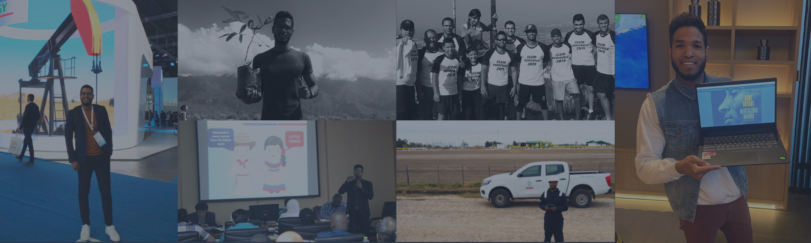

+ **Idioma: Inglés Avanzado** | **Español: Lengua Madre**

+ **Microsoft 365** | **Power Bi** | **Project MS**

+ **Lenguaje de programación R** (Básico)

+ **Fundamentos de Gestión de Proyectos**

+ **Fundamentos de Gestión de Equipos IT y Programación**

+ **Fundamentos de Análisis Empresarial**

+ **Fundamentos Profesionales de IA Generativa**

+ **Locutor Certificado de Venezuela** | **Registro: 55.777** | **Universidad Central de Venezuela**

+ **Piloto Aficionado de Dron Civil/VANT - Clase A | Audiovisuales**

+ **Deportes: baloncesto, voleibol, softball, ultimate frisbee**

<footer style="text-align: center;">

 2024 • Currículum web desarrollado por Ing. César Briceño  • RMarkdown 

</footer>