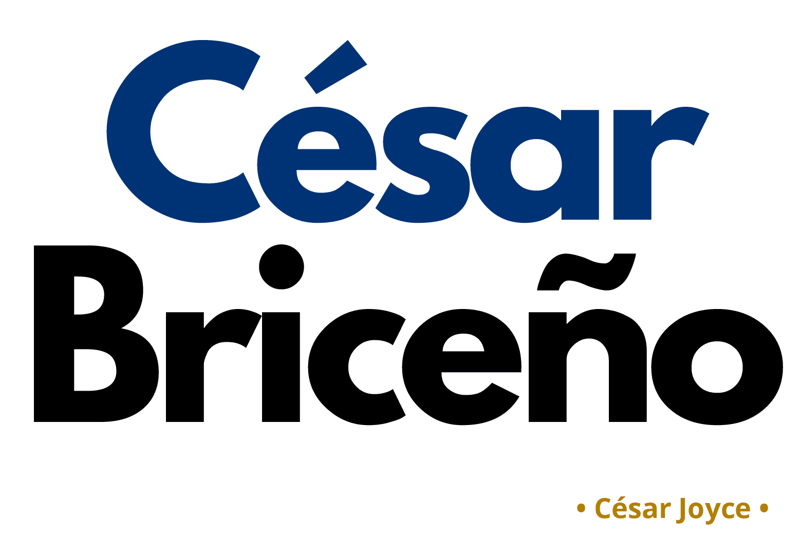

### ¡Bienvenidos a mi espacio profesional!

### Soy César Briceño y agradezco su interés en conocer más sobre mi trayectoria. En este perfil, podrán explorar en detalle mi experiencia, habilidades y logros. Estoy comprometido con la excelencia y me esfuerzo por ser versátil y adaptable en cada proyecto. Mi enfoque se centra en la mejora continua y en la búsqueda de soluciones efectivas y prácticas. Espero que esta visión de mi carrera y capacidades les sea útil para evaluar cómo podría contribuir al éxito de su equipo. ¡Gracias por su tiempo y consideración!

|   Celular   |                                     Email                                      |      Domicilio       |                             RRSS                             |
|:---------------:|:---------------:|:--------------------:|:---------------:|
| 11 27557211 | [cesar.joyce.briceno\@gmail.com](mailto:cesar.joyce.briceno@gmail.com){.email} | CABA - Villa Urquiza | @csar.joyce / [César Briceño LinkedIn](https://www.linkedin.com/in/c%C3%A9sar-brice%C3%B1o/) |

<footer style="text-align: center;">

 2024 • Currículum web desarrollado por Ing. César Briceño  • RMarkdown 

</footer>